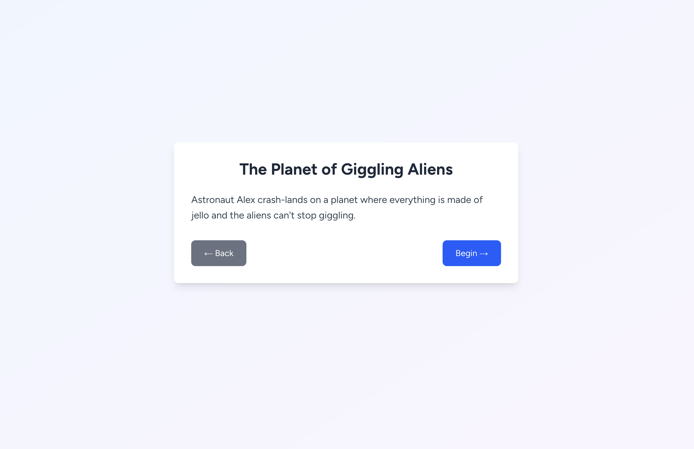

# Collaborative Audio Storytelling with AI [Demo]

What if we brought AI into the creative process rather than just use AI to offload all our tasks? From that question came this idea to use AI to collaboratively build a story together. This is a voice-driven demo where users and an AI take turns to build a story. 


There are currently 5 categories to choose from when starting a story. These are related to adventure, space, fantasy, cooking and sports. 


For each theme there are a handful of pre-built openings and the user is presented one at random. Openings were generated with an LLM and stored.



Once a story begins, the AI will read the part of the story and prompt the user to contribute the next part. The AI will take this and build the next part of the story. Images are also generated based on the current content of the story.

### Ending story time
A session can be manually ended by clicking the button "End Storytime". Alternatively, there is an internal narrative turn counter which will trigger once the number of turns exceeds a certain threshold. The number of turns is incremented when the AI responds.


## Tech Stack

- **Frontend**: Next.js with TypeScript and Tailwind CSS
- **Backend**: Python FastAPI
- **Package Managers**: npm (frontend), uv (backend)
- **Conversational AI**: ElevenLabs using gpt-4o-mini
- **Image Generation**: OpenAI gpt-Image-1
- **Backend LLM**: OpenAI gpt-4o-mini

### Working with OpenAI
I used OpenAI's [Responses API](https://platform.openai.com/docs/api-reference/responses) for both text and image outputs.

### Working with ElevenLabs
The demo is built with ElevenLabs Conversational AI and uses the [React SDK](https://elevenlabs.io/docs/conversational-ai/libraries/react) to handle the conversation on the frontend. Implementation is in `frontend/src/app/story/page.tsx`.

Initially turned to OpenAI for all AI features including real-time conversation however it proved to be quite expensive for this and so went with ElevenLabs. ElevenLabs cost me about $15 to run test over a 7 day period. It isn't cheap and will likely be even more expensive after June 21st 2025 when the cost of the underlying LLM calls will be passed onto the user. Luckily I had existing credits.

Some challenges I ran into when using ElevenLabs:

1. **Triggering Conversation States**: No obvious way to trigger conversational states. Luckily this is a fairly linear flow but I ran into issues when trying to force the agent to end the call without the user explicitly asking. I managed this by keeping track of a narrative count and then sending a message via `sendContextualMessage` to the agent. I had to include additional instruction in the system prompt to look out for this but I'm not entirely convinced this approach is very reliable. Sometimes it worked other times not.

2. **Agent Patience**: A child isn't likely to respond with a new thought without pause. In most cases, they will take time to answer, start, stop and generally respond in an unpredictable way. These agents are quite sensitive to pauses and don't offer much space for thinking once they detect some initial speech and so often cut the user off. 

   This could potentially be managed on the interface side with a 'push-to-talk' feature but I wanted this to be a hands-off experience.

   On the modelling side, perhaps something like semantic voice activity detection would be the way to go.

3. **Audio Sensitivity**:
Generally, the ElevenLabs agent seemed sensitive to background noise. I'm not sure how this is handled in production settings by other users.


4. **Separating Story Text**: To make it visually appealing and easy to follow along, I wanted to provide a transcription of the story. To separate the other parts of the conversation from the story elements, I prompted the ElevenLabs LLM to encapsulate the story portions with tags `<story>` and then extracted those for display.


## Getting Started

### Prerequisites

- Node.js and npm
- Python 3.12+
- uv (Python package manager)
- OpenAI API key
- ElevenLabs API & Agent ID

### Backend Setup

1. Navigate to the backend directory:
   ```bash
   cd backend
   ```

2. Create a `.env` file with your OpenAI API key:
   ```bash
   OPENAI_API_KEY=your_openai_api_key_here
   ```

3. Start the development server:
   ```bash
   uv run fastapi dev main.py
   ```

The backend will be available at `http://localhost:8000`

### Frontend Setup

1. Navigate to the frontend directory:
   ```bash
   cd frontend
   ```

2. Install dependencies:
   ```bash
   npm install
   ```

3. Environment Variables

   copy `.env` to a `.env.local` and set the environment variables. These can be obtained from 
   your ElevenLabs account dashboard.

   ```bash
   NEXT_PUBLIC_ELEVENLABS_API_KEY=your_api_key_here
   NEXT_PUBLIC_ELEVENLABS_CONVERSATION_AGENT_ID=your_agent_id_here
   ```

4. Start the development server:
   ```bash
   npm run dev
   ```

The frontend will be available at `http://localhost:3000`

## Areas for Improvement
Plenty of areas to enhance the experience such as:

- Managing patience of the agent to give the user more time to think and respond naturally
- Character consistency for images.
- Storing the stories for later viewing or sharing.

And plenty of other improvements to the UI.

